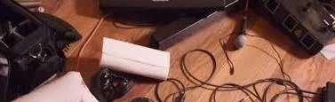
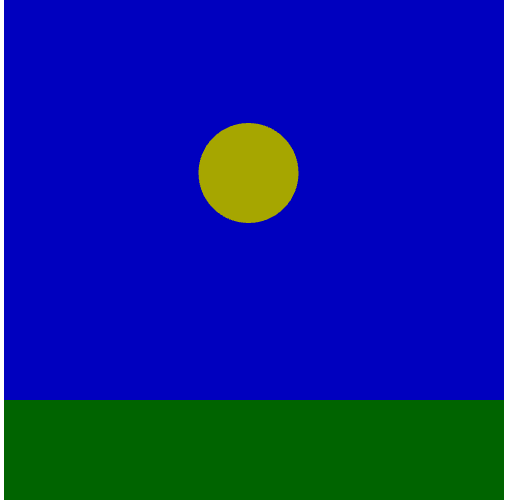

# Luca's Course Website 
 

welcome to my CART253 course website. this website is to collect together and show off my prototyping work in CART253
## Prototypes

Outer Wilds. This picture is a tribute to the game outer wilds. this tribute obviously does not do it justice but its an amazing game based on [space.](http://127.0.0.1:5500/topics/prototypes/instructions-prototype-2/template-p5-project/)

The Last Sunset. This one is meant to be kinda like when poeple talk about bleeding out in the snow watching the orange sun go down for the last time knowing that everything will be ok, they don't have to worry [anymore.](http://127.0.0.1:5500/topics/prototypes/instructions-prototype-1/template-p5-project/)

Smiley Face. I felt like I got intense in the other ones so I made a [happy face.](http://127.0.0.1:5500/topics/prototypes/instructions-prototype-3/template-p5-project/)

 Hyper Speed is meant to be kind of like traveling through warp speed in star wars or other space related [media.](http://127.0.0.1:5500/topics/prototypes/variables-prototype-3/template-p5-project/)

 
 Timezones is exactly what it sounds like. Depending on the location of the mouse the time of day/night [changes.](http://127.0.0.1:5500/topics/prototypes/variables-prototype-1/template-p5-project/)

 
 Planet Eateris one im especially proud of as it is kind of a little game where you eat the planets and then click to [reset.](http://127.0.0.1:5500/topics/prototypes/variables-prototype-2/template-p5-project/)

## Links
[Youtube](https://www.youtube.com/@Lucagarreffazoom) 
## Journal
[My Reflective Journal](./journal.md) 

