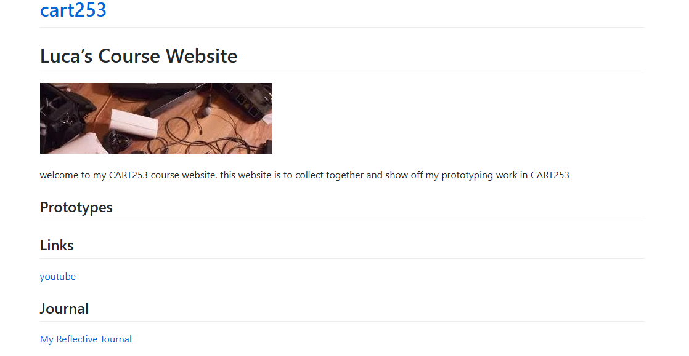

# Reflective Journal
## september 15 2026
I’ve learned a lot about Markdown and how to use it for my websites, especially for things like headings and other formatting. At first, I thought I would struggle with it and that it would be more complicated than it actually was. I was surprised by how simple it was once I started using it and understanding how everything worked. It was cool to see the workings of a website behind the scenes and understand how the different parts come together to create what you see on a website.
One thing I had a lot of trouble with was needing to commit my work to main for it to actually show up on the website. It was sometimes frustrating because I expected my changes to appear right away, but I learned that I had to make sure everything was committed properly before I could see the changes online.
Overall, I enjoyed learning about Markdown and working with websites in this way. I hope that what I made can make other people interested in coding and encourage them to try it for themselves. My aspirations for this are to become comfortable enough with Markdown and coding that I can do things like this easily and on a bigger scale. I want to be able to understand what I am doing without struggling as much and eventually create bigger and more complicated websites while still feeling confident about the process.

